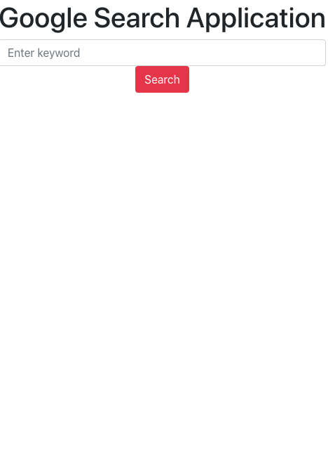

# Google Book Search

## Overview

The google book search is an application that allows the user to search for books, view information about them and then save them for later. When the user searches the book they will be displayed with the title, author, description, image, a link to view  the information and a link save for later. 

## Installation
[Mongodb](https://www.mongodb.com/cloud/atlas/lp/try2?utm_source=google&utm_campaign=gs_americas_united_states_search_brand_atlas_desktop&utm_term=%2Bmongo%20%2Bdatabase&utm_medium=cpc_paid_search&utm_ad=b&utm_ad_campaign_id=1718986498&gclid=CjwKCAjw1uiEBhBzEiwAO9B_HawJVo6p1MNL2l2-qurKoZfbu0VZOc6MAvE55CoDbXeqP9lPfm_rwhoC0AsQAvD_BwE)
[Express](https://www.mongodb.com/products/compass)
[React](https://reactjs.org/)
[Node](https://nodejs.org/en/)
[Compass](https://www.mongodb.com/products/compass)
[Heroku](https://id.heroku.com/login)

## Usage 
The following image displays the home page: 

The following image displays the information displayed for each book:

The following image displays the result of selecting the view button:

